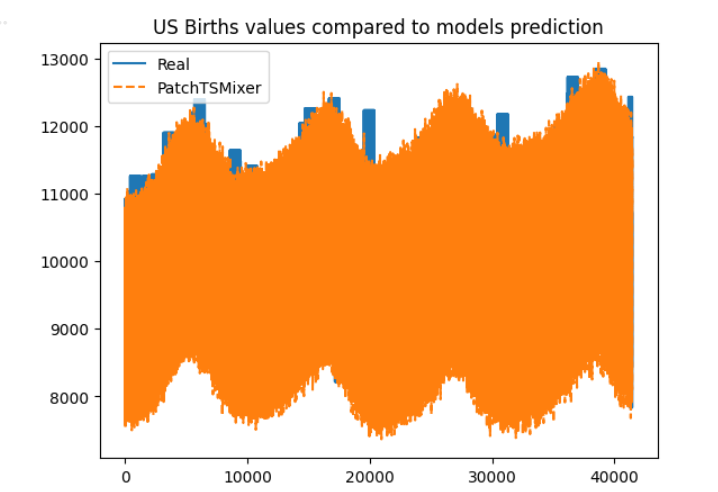
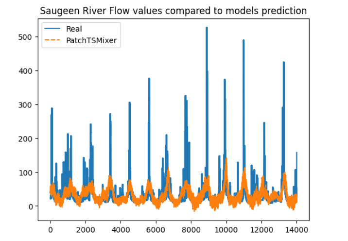
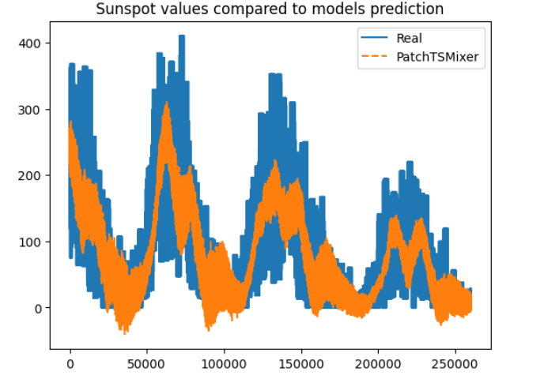
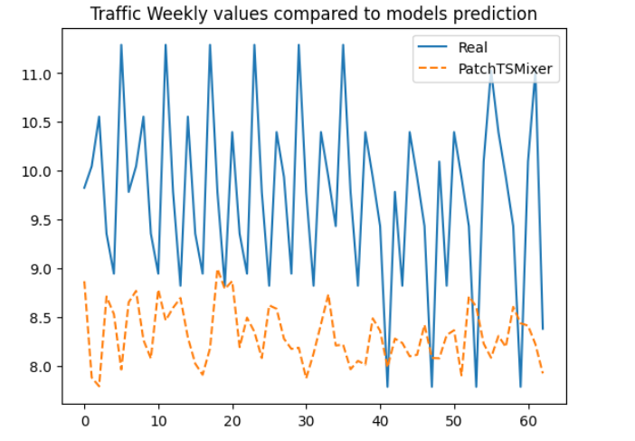
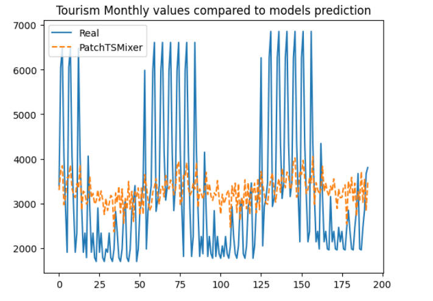

# foundation-models
A time series forecasting project developed for a MEISSA Project (LIAD/UFCG) training using the PatchTSMixer foundation model. The project analyzes multiple time series datasets, including US Births, Saugeen River Flow , Sunspot, Traffic Weekly, and Tourism Monthly. 

**DESCRIPTION**

This project explores time series forecasting using the PatchTSMixer (an IBM foundation model), applied to different types of datasets with different frequencies. The datasets include US Births (daily births in the United States from 1969 to 1988), Saugeen River Flow (daily river flow from 1915 to 1979), Sunspot (daily sunspot counts from 1818 to 2020), Traffic Weekly (road occupancy rates in San Francisco from 2015 to 2016), and Tourism Monthly (monthly tourism data). For consistency, a single time series was selected from each dataset. The model’s performance is also evaluated using common forecasting metrics, including MAE (Mean Absolute Error), RMSE (Root Mean Squared Error), and SMAPE (Symmetric Mean Absolute Percentage Error).

Below are 5 graphs comparing the model's prediction of each dataset to its real values.

**HOW TO RUN**

1. Click on "Open In Colab"
2. Run all cells

**AUTHOR**

Anne Grazieli Marques Silva, Computer Science student at UFCG
